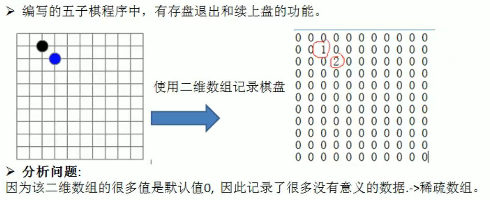
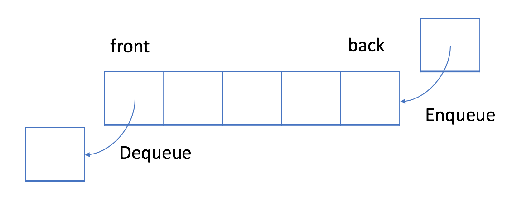

# Golang Mark

---

## 程序流程控制：

在程序中，程序运行的流程控制决定了程序是如何执行的，是我们必须掌握的！主要的流程控制语句有三大类：

- 顺序控制
- 分支控制
- 循环控制

### 1.顺序控制：

程序从上到下逐行执行，中间没有任何的判断和跳转！

        package main
        
        import "fmt"
        
        func main() {
        //假设还有100天放假，还有几个星期？
        var days int = 100
        var week int = days / 7
        var day int = days % 7
        
            fmt.Printf("%d天后放假 === %d周%d天后放假", days, week, day)
        }

### 2.分支控制：

分支控制就是让程序有选择的执行，一般有一下三种分支：

- 单分支
- 双分支
- 多分支

#### 2.1 单分支：

<strong>基本语法</strong>

        if 条件表达式{
            满足条件表达式后，执行代码块
        }

#### 2.2 双分支：

#### 2.3 多分支：

---

## 函数、包、错误处理：

### 1.函数的基本概念：

为完成某项功能的程序指令（语句）的集合，称为函数。在Go中，函数分为：

- 自定义函数
- 系统函数

<strong>函数的基本语法</strong>

        func 函数名(形参列表)(返回值列表){
            执行语句...
            return 返回值列表
        }

- 形参列表：表示函数的输入
- 函数中的语句：表示函数执行（完成）的具体功能语句
- 函数返回值：返回函数的处理结果，可有可无

### 2.包的基本概念：

包的本质就是创建不同的文件夹，来存放不同的go文件

go的每个文件都属于一个包，也就是说go以包的形式来管理文件和项目目录结构

打包基本语法： `package 包名` 

引入包基本语法：`import "包基本路径"` 

#### 包的注意事项和细节说明：

- 在给一个文件打包时P112

---

## 文件操作：

### 1.基本概述：

文件在程序中是以流的形式来操作！os.File封装了所有文件相关操作，File是一个结构体！

- 流：数据在数据源（文件）和程序（内存）之间经历的路径
- 输入流：数据从数据源（文件）到程序（内存）的路径
- 输出流：数据从程序（内存）到数据源（文件）的路径

### 2.文件操作API：

中文文档地址：http://doc.golang.ltd/pkg/os.htm#File

#### 常用方法：

### 3.文件的基本操作：

--- 

# 数据结构-算法

> 程序 = 数据结构 + 算法

## 一、稀疏数组 sparsearray：

### 1.稀疏数组简介：

当一个数组中大部分元素为0，或者为同一个值的数组时，可以使用稀疏数组来保存该数组。

<strong>稀疏数组的处理方法：</strong>
- 记录数组一共有几行几列，有多少个不同的值
- 把具有不同值的元素的行列及值记录在一个小规模的数组中，从而缩小程序规模

### 稀疏数组应用实例：

1. 使用稀疏数组，保存类似二维数组
2. 把稀疏数组存盘，并且可以重新恢复为二维数组

#### 思路分析：
 

对于二维数组，使用切片保存数值节点信息，节点包含了该值元素在二维数组中的索引位置信息和值信息。

使用双层for循环完成值遍历

#### 代码实现：

    package main
    
    import "fmt"
    
    func main() {
    // 创建一个11 × 11 数组：
    var Map [11][11]int
    
        // 记录位置：
        Map[1][2] = 1 //使用1表示黑子位置
        Map[2][3] = 2 //使用2表示白子位置
    
        // 循环遍历数组：
        for _, v := range Map {
            for _, v2 := range v {
                fmt.Printf("%d  ", v2)
            }
            fmt.Println()
        }
    
        // 定义节点；
        type ValueNode struct {
            row int
            col int
            val int
        }
    
        /*
            转换稀疏数组思路：
            1. 遍历Map，如果发现一个数组的某一个元素不为0,就为这个元素创建一个节点
            2. 将其保存在这个节点中（切片）
        */
        var sparseArr []ValueNode
    
        // 标准的稀疏数组还应该记录原始二维数组的shape
        // 创建一个节点，存放原始信息：
        valNode := ValueNode{
            row: 11,
            col: 11,
            val: 0,
        }
    
        // 把原始信息节点存放到切片中：
        sparseArr = append(sparseArr, valNode)
    
        // _ 这个下划线表示占位符
        for i, rows := range Map {
            for j, v := range rows {
                if v != 0 {
                    // 创建元素值结点：
                    valNode := ValueNode{
                        row: i,
                        col: j,
                        val: v,
                    }
                    // 向切片中追加元素：
                    sparseArr = append(sparseArr, valNode)
                }
            }
        }
    
        // 输出稀疏数组：
        fmt.Println("稀疏数组：")
        for i, valNode := range sparseArr {
            fmt.Println(i, "---", valNode)
        }
    }

---

## 二、队列：

- 队列是一个有序列表，可以用数组或者是链表实现
- 遵循先入先出的原则：先存入队列的数字，要先取出。后存入的要后取出。

### 1.使用数组实现队列：

- 队列本身就是有序列表，使用数组的结构来实现存储队列数据。
- 队列的输入输出，分别从前、后来处理，因此需要两个变量front、back来标记。front会随着数据的输出而该改变、back会随着数据的输入而改变。
- 使用maxSize维护数组的最大容量

#### 非环形队列：

<strong>设计思路：</strong>

1. 创建一个数组array，是作为队列的一个字段
2. front表示队列的头部，初始化为-1
3. back表示队列的尾部，初始化为-1
4. 完成队列的基本功能：
   1. addQueue：向队列添加数据
   2. getQueue：获取队列数据
   3. showQueue：显示队列数据

当我们将数据存入队列时：

1. 将队尾执政往后移
2. 若队尾指针小于等于队列最大下表MaxSize，则数据存入back指针指向的索引位置，否则无法存入数据。