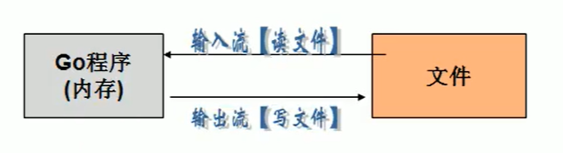
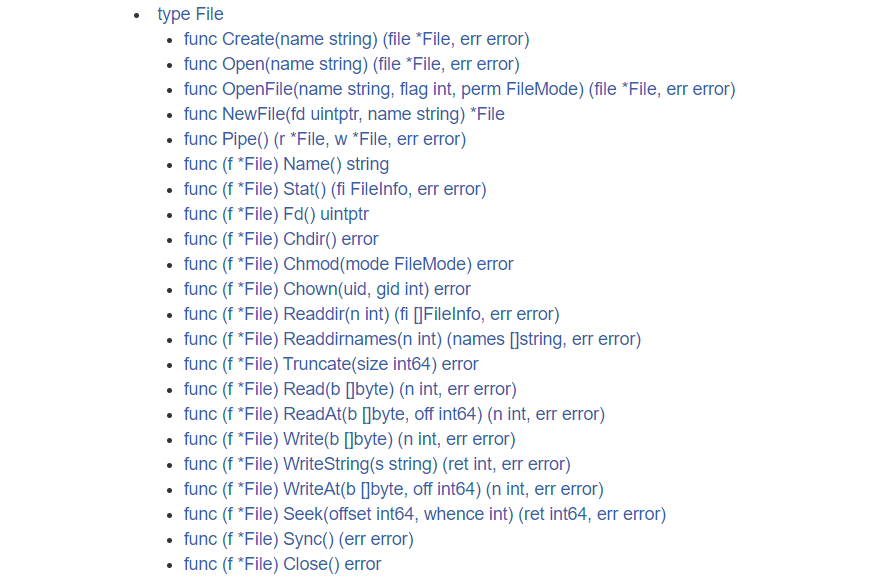

# Golang Mark

---

## 程序流程控制：

在程序中，程序运行的流程控制决定了程序是如何执行的，是我们必须掌握的！主要的流程控制语句有三大类：

- 顺序控制
- 分支控制
- 循环控制

### 1.顺序控制：

程序从上到下逐行执行，中间没有任何的判断和跳转！

        package main
        
        import "fmt"
        
        func main() {
        //假设还有100天放假，还有几个星期？
        var days int = 100
        var week int = days / 7
        var day int = days % 7
        
            fmt.Printf("%d天后放假 === %d周%d天后放假", days, week, day)
        }

### 2.分支控制：

分支控制就是让程序有选择的执行，一般有一下三种分支：

- 单分支
- 双分支
- 多分支

#### 2.1 单分支：

<strong>基本语法</strong>

        if 条件表达式{
            满足条件表达式后，执行代码块
        }

#### 2.2 双分支：

#### 2.3 多分支：

---

## 函数、包、错误处理：

### 1.函数的基本概念：

为完成某项功能的程序指令（语句）的集合，称为函数。在Go中，函数分为：

- 自定义函数
- 系统函数

<strong>函数的基本语法</strong>

        func 函数名(形参列表)(返回值列表){
            执行语句...
            return 返回值列表
        }

- 形参列表：表示函数的输入
- 函数中的语句：表示函数执行（完成）的具体功能语句
- 函数返回值：返回函数的处理结果，可有可无

---

## 文件操作：

### 1.基本概述：

文件在程序中是以流的形式来操作！os.File封装了所有文件相关操作，File是一个结构体！

- 流：数据在数据源（文件）和程序（内存）之间经历的路径
- 输入流：数据从数据源（文件）到程序（内存）的路径
- 输出流：数据从程序（内存）到数据源（文件）的路径

### 2.文件操作API：

中文文档地址：http://doc.golang.ltd/pkg/os.htm#File

#### 常用方法：

### 3.文件的基本操作：

